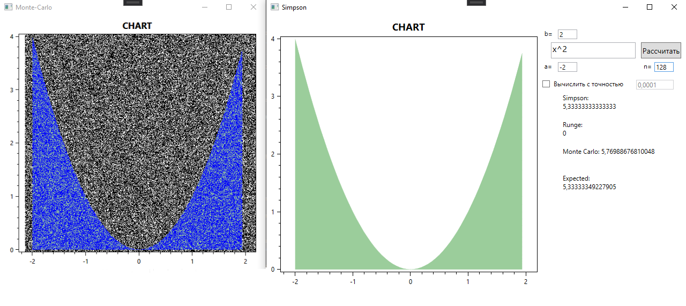
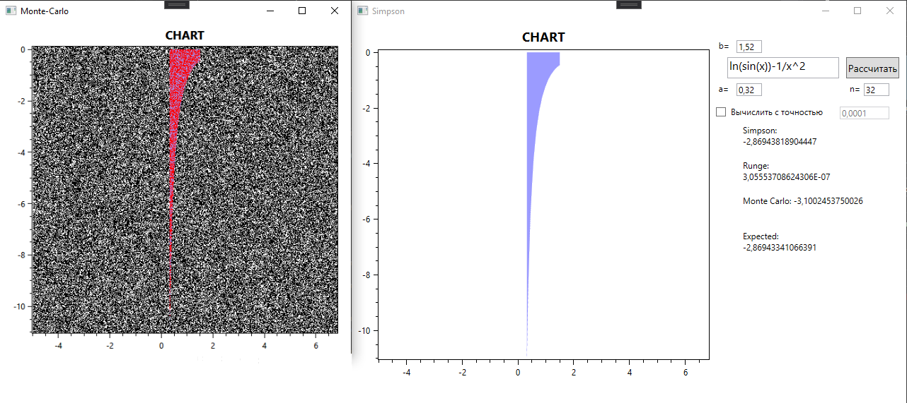

# README #
Программа реализует два метода численного интегрирования в следующих комбинациях:
1)	Метод Симпсона с контролем погрешности по формуле Рунге;
2)	Метод Монте-Карло.

* Для парсинга выражения используется библиотека [mxparser](http://mathparser.org/).

### Результаты вычисления ###

* Simpson – значение полученное при помощи метода Симпсона, число в скобках показывает количество отрезков.
*	Runge – значение погрешности полученное при помощи метода Рунге.
*	Monte Carlo – значение полученное при помощи метода Монте-Карло.
*	Monte Carlo Error – значение погрешности метода монте карло.
* Expected – интегральное вычисление при помощи библиотеки mxparser.
